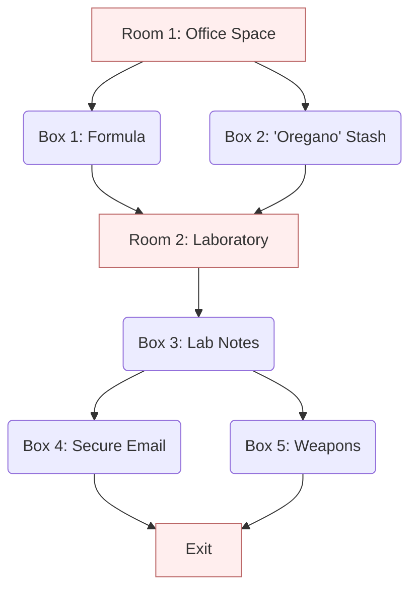

Ready create your own escape room? This page goes over the basics to get
you started.

## Anatomy of an Escape Room

Before we jump into discussing designing the particular elements of an
escape room, let us first consider the overall structure of the design. If
you have participated in an escape room, at any time you were probably
thinking in terms of the things you found and the locks you had to open.
But when designing an escape room, it is helpful to think of the structure
in terms of _rooms_[^room] and _boxes_.

A room is, well, a room. It is a space in which players can roam. It also
contains clues, items, and boxes as well as potential passages to other
rooms and the exit. Boxes are containers that likewise contain clues and
items.

Both rooms and boxes are opened by solving a puzzle that allows them to be
opened (except, of course the room the players start in). From a design
standpoint, rooms and boxes are very similar.

Once the rooms and boxes have been decided on (we will get to how to do
that shortly), the elements can be arranged in a flow diagram that
specifies the order in which players must solve them. Here is an example of
how an escape room might be structured.

What makes organizing your escape room this way so important is that it
allows you to ensure that the arrangement of items in your escape room is
correct. In particular, the arrangement of items in your escape room
must follow the following 2 rules.

  1. The puzzle for any box or room must need only items that are
     accessible without the items in that box or room.
  2. It should not be possible to open a box or room before its time.

Of these 2 rules, the first is the most important. If it is broken, the
escape room cannot be solved. In the example above, `Box 1` better not
require an item that is located in `Room 2`. If that is the case, then the
players will never be able to progress because they need `Room 2` to open
`Box 1` but need `Box 1` to open `Room 2`. Avoiding this situation is easy
with the flowchart. Simply ensure that all the items required for the
puzzle of any given box or room are located in an earlier node.

The second rule is a bit less important because violating it at least
doesn't get the players stuck. Still, you don't really want the players to
be able to open the exit without solving all of the previous puzzles. Also,
the story comprising your escape room might make less sense if things are
opened in the wrong order. And there may be cases where 2 locks need to be
opened in a certain order. You should make sure the second cannot be opened
before the first. This can be verified by making sure that the puzzle for
every box and room requires at least one item from every node pointing
directly to it.

Although the full flowchart is useful, in truth I rarely ever draw out the
whole thing. It is simply too inconvenient during the design process when
the structure is constantly shifting. Instead, I usually just write things
out in a linear outline. The outline is a simple ordered list of rooms and
boxes, like this.

{}
  * **Room 1**
    * Items
      * Item 1
      * Item 2
  * **Box 1**
    * Puzzle
	  * Do X with item 1
	  * Do Y with item 2
	* Items
	  * Item 3
	  * Item 4
  * ...
{}

An outline like this is easy to edit in a text editor or word processor.
Also, it is easy to verify rule 1, any box/room needs items only from
accessible boxes/rooms. To verify this, simply search each item in a puzzle
and verify that it occurs earlier in the document. Rule 2, verifying that
you cannot open a box/room too early, is a bit harder without the
explicit flowchart. But you can once again check where the items that each
puzzle requires are revealed and make sure that at least one of the items
appears in a room or box that should be open first.

## The Plot

Right now you might be thinking, _Plot? I want to make escape rooms, not
write stories. We're already 3 pages into this stupid web site and we're
still talking about things like plot._

I admit that on the first time I set out to make an escape room, I didn't
give much credence to the story. But what I found is that the story is
important for a couple of reasons. First, the story provides purpose for
the players. It is what elevates the game above a simple puzzle collection.

Second, constructing the story early helps with the overall design of the
escape room. The plot points of the story form the aforementioned rooms and
boxes that structure the room. I'm constantly surprised how, once I come up
with the basic plot structure, how quickly the rest of the escape room
comes together. Simply having an idea of what each room and box will mean
helps come up with creative ideas.

That's not to say that the design of the escape room should be a linear
process. After outlining the basics of the plot, I find it most useful to
bounce back and forth from puzzle design to plot refinement and back. The
plot points can provide inspiration for clever puzzle designs. And the
design of puzzles can provide interesting refinements for the plot.

## The Puzzles

Yes. Finally. The puzzles. The best part of any escape room.

The puzzles can be pretty much anything. And, of course, you'll find lots
of suggestions on the [puzzles] pages here. But, remember as you
design puzzles that you are not creating the same variety of puzzles that
you might find in, say, a book of crossword or Sudoku puzzles. So, here are
some features of the best escape room puzzles.

  * **Lateral Thinking** The best escape room puzzles are solved with a bit
    of lateral thinking. The puzzles comprise a collection of items and
    clues that on face value have no particular significance. But when
    looked at differently or put together in the right way, a secret
    meaning is revealed.
  * **Shortness** The mechanics of the puzzle should not take a long time
    to complete. Players might take a long time to figure out to solve a
    hard puzzle, but once they achieve that "ah-ha" moment, the answer to
    the puzzle should be quick and self evident.
  * **Uniqueness** Each puzzle in the escape room should be unique. In
    fact, none of the players should have ever seen any of the puzzles or
    anything like them.

When starting the puzzle design for your escape room, it is good to start
by browsing [puzzle suggestions][puzzles] from this site and others while
keeping these features in mind. You can also get inspiration from any
commercial escape rooms that you have done. As you think about potential
puzzles, it is a good idea to keep a list of potential ideas, even if you
do not yet have an idea where you will use it. You never know when
inspiration will hit, and it is good to jot down ideas as they come before
they are forgotten.

## The Space

As you are designing your escape room, consider the space in which you are
going to construct it. Presumably, you are going to repurpose one or more
rooms of your house or other living space to do it.

You have probably noticed that in the general descriptions I have given so
far, I often refer to multiple rooms. There is something pleasant about
opening new spaces midway through the game. It keeps the game fresh and
gives a nice indication of progress. That said, you are in no obligation to
use more than one room if you so choose.

If you do decide to use multiple rooms, consider the options in your
dwelling and decide how the players will move from one room to the next.
Perhaps you are fortunate enough to have two adjacent rooms with a
connecting door, which simplifies things. If you don't have such a spot,
you may need to improvise.

If you don't have 2 adjoining rooms, don't fret. DIY escape rooms are all
about improvising. Perhaps you can find 2 rooms that are separated by a
short walk down a hallway or by a jack-and-jill bathroom. You could
potentially work the separating space into the escape room, or simply
instruct the players to ignore things in between the rooms. Another option,
if you have a large enough room, is to divide it into parts. One simple way
to create a partition is to hang sheets from the ceiling or a clothesline.

Chances are, the rooms you are using are not empty. They will have
furniture --- tables, sofas, shelves, and the like. Some of these elements
can be incorporated into the game if they fit. Otherwise, they can be moved
off to the side. You can cover them with a sheet or simply instruct players
they have no relevance to the escape room.

## Playing the Escape Room

Once you've designed your escape room, built all your puzzles and props,
set up everything in your rooms, and tested to make sure everything works,
you are ready to play the game. The game operates with a proctor (that's
you, the designer of the game) and some number of players. 1-4 players at a
time usually works best.

The proctor starts the game by going over the instructions of the game.
These establish the ground rules. This will include some basic escape room
stuff, like what type of locks are being used and how they are operated.
But you will probably have extra instructions due to your improvisations.
For example, I often lock boxes and doors using padlocks attached to
string, so I always instruct the players to not untie any of the string;
rather all puzzles should be solved by opening the padlock. This is also a
good time to let players know of anything _not_ part of the game (e.g.
ignore anything in the cabinets).

With the rules out of the way, the proctor then describes the scenario. My
preference is to keep this description short by telling the players only
who they are, where they are, and what they are immediately doing.
Something like, "The group of you have been summoned to your recently
departed uncle's old mansion at the top of the hill. You all stand to
inherit a small fortune, but no one has yet found the will. Your lawyers
have urged you to come here in hopes that you find the will and avoid a
lengthy legal battle." Remember that an escape room is also an interactive
story, so the plot should progress and the stakes should be raised as the
players progress (e.g. the will you find stipulates you must spend the
night to inherit the fortune; you find that the mansion is actually filled
with deadly traps; you discover that your uncle was deep into the occult
and plans to sacrifice your souls to return to an immortal life).

From here on out, the players run the game. The proctor sits back and
quietly monitors the players. One of the functions the proctor should
perform is to ensure that the players do not accidentally (or intentionally)
circumnavigate or break the puzzles. To win an escape room, players need to
explore aggressively and use items in unconventional ways. That could lead
players to do things you had not anticipated. For example, I once had a
puzzle involving a key trapped in a mechanism that required a secondary
object to fetch the key out. Instead, one of the players picked up the
mechanism and shook out the key. Oops, that was missing the point. So, I
said that, no, the mechanism is supposed to be affixed to the table, and
you cannot lift it up. Then I reset the puzzle so the players could try
again.

The other major function of the proctor is to provide hints when the
players get stuck. Hints should be given sparingly; the big fun of playing
an escape room is solving the puzzles. I personally find that after going
through the setup for the game, I have a hard time keeping quiet about the
puzzles, so I have to concentrate on sitting back and watching. 

That said, the escape room gets frustrating if the players cannot figure
out a puzzle. Once all the players agree that they need a hint, give one.
Try to give a hint that nudges the players in the right direction without
giving the solution outright. For example, if the players are struggling to
decode a message, a hint might be to look for clues displayed around the
room to help direct them to the item posted to the wall that provides the
decoder.

Although the proctor does not get to play the game (you already know all
the answers), administering an escape room is a fun and rewarding
experience in its own right.

[^room]: You may notice that the word "room" is being overloaded here. The
    game that is colloquially refereed to as an "escape room" often
    actually comprises multiple physical "rooms". To be clear, we are using
    the phrase "escape room" to refer to the game as a whole whereas the
    single word "room" means a specific partition of the space.

[puzzles]: /puzzles
