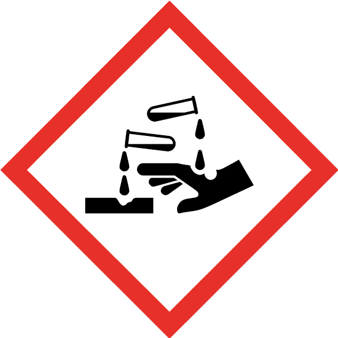

This puzzle starts with a simple to construct tool: a magnet tied to the
end of a string.



The weight of the magnet allows it to be easily lowered into spaces.

The second part of the puzzle involves a container with a small opening.
Inside the container is a key or some other small metal object that is
needed to continue in the room. In the following example, I am using a vase
with a narrow opening that prevents players from reaching the contained key
with their hand.



To retrieve the key, the players must lower the magnet into the container,
get it to stick to the key, and lift the magnet back up with the string.
Overall, this is an easy puzzle but still satisfying, making it good for
players of any age or skill level.

When setting up this puzzle, make it clear that players should not pick up
the container or attempt to pour out the key. What I did in the example
above is to put water in the vase with the key and leave a note that makes
it clear that players should not touch or spill the liquid.

{}

Be careful. This is a highly corrosive acid. In retrospect, maybe I should
not have left such a dangerous substance laying around the lab.

DO NOT TOUCH! DO NOT SPILL!
{}
