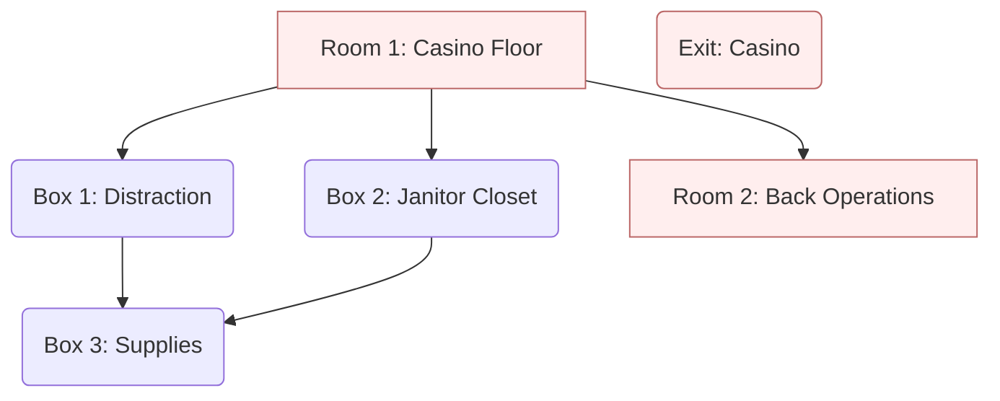

## Synopsis

_Casino Heist_ is an escape room that puts players in the role of a crack team
of burglars on a mission of retribution. This game can be broken into many rooms
with lots of places to explore.

The game is divided in multiple spaces. This is a casino heist, so of course you
will have a casino floor room with a card table decked out for a game. Later,
players will move to the operations part of the casino. This contains rooms for
the cashier, office, and janitor. You don't need a full room for each space.
Several spaces can be tucked in a closet or partitioned off with sheets. The
[flow diagram] and [setup] are at the end of this page. The [setup] also has
materials you can use to help you build the puzzles.

[flow diagram]: #flow-diagram
[setup]: #equipment-and-setup

## Scenario

You (the players) are here to rob the Lucky Strike casino. More specifically,
you are here to rob the bankroll of infamous mob boss Don Calzone, who owns the
casino. Calzone has been running a protection racket on you for years and then
recently turned around and stole what remained of your savings. The police won't
help, and with nowhere left to turn, you must steal your money back.

You have partnered with the infamous cat burglar Pierre Voleur, who has helped
you plan this operation, for a cut. The plan is to create a distraction at the
gaming tables, don an employee uniform, and sneak past the cashier. Once back
there, you will rewire the security cameras and break into the office. From
there, you should be able to get what you need to break into the vault.

## Casino Floor (Room 1)

The players enter the casino floor as unassuming customers. The space should be
set up with one or more gaming tables. These can be simulated with a simple
table and a green covering. The puzzles use props like card decks and glasses to
help complete the ensemble.

## Distraction (Box 1)

Before sneaking around, the thieves need to distract security and the other
personnel. They monkey with the cards on a gaming table and disrupt the game. In
the confusion, the thieves grab the pit boss' briefcase.

**Suggested Puzzle** On one of the tables is a fanned out deck of cards fanned.
The players can play with the cards (hopefully preserving the order). If the
players are observant, they will see that when the cards are stacked, there is a
[message on the side of the cards].

[message on the side of the cards]: /puzzles/arrangement/card-edge-message

## Janitor Closet (Box 2)

Once inside, the players assume the role of janitors so they may sneak in areas
beyond the customer floor. They open a janitor closet and collect supplies.

When setting up your room, if there is a closet available, you can place a lock
on that and use it as the "box." If one is not available, a locker or more
traditional box like a suitcase will also work fine.

**Suggested Puzzle** Scattered around the room are crumpled pieces of paper and
glasses of various sizes with numbers. These items form a [water rings] puzzle.
Players must collect the paper, flatten them out, reconstruct them to a single
sheet, and match the glass bottoms to the marks on the paper. The order of the
glasses forms a numeric code.

[water rings]: /puzzles/arrangement/water-rings/

## Cashier/Back Operations (Room 2)

After collecting helpful items around the casino floor, the players must sneak
into the business regions of the casino. This is where the things most important
to thieves like you such as the office and vault. First, the players sneak past
the cashier cages.

The main feature of the back operations is the vault, which is the target of the
players.

**Suggested Puzzle** As would be expected in a casino, many poker chips are to
be found. The players must solve a [group and count] puzzle by collecting all
the chips and partitioning them by color. Using a color key, the count of each
chip color forms a digit of the code.

[group and count]: /puzzles/arrangement/group-and-count

## Supplies (Box 3)

The supply closet happens to contain the wiring junction box for the camera
system. The players need to gain access to disable the camera.

This box works well as a closet in either the casino floor room or the back
operations room.

**Suggested Puzzle** To simulate getting in costume to avoid suspicion, the
players complete a [body parts] puzzle with a janitor's outfit. The players
collect the janitor's outfit from the janitor's closet as well as an [employee
start shift regulations] pamphlet. The shift regulations give an idea of how bad
it must be to work for the jerks that run the casino, but it also contains an
exercise routine specifying body parts. These parts refer to numbers on the
janitor's outfit to provide the code for the supply room.

[body parts]: /puzzles/decoders/body-parts/

## Flow Diagram

The materials and suggested puzzles of this escape room follow the
following flow diagram.

## Equipment and Setup

Here is a list of equipment you will need if setting up your escape room in the
same way as described above. This is organized by the items in the flow diagram
above. Where possible, I have provided material for you.

* [Room 1: Casino Floor](#casino-floor-room-1)
  * Contains one or more gaming tables with cards lain out, betting chips, and
    other items typical of a gambling hall.
  * Items:
    * Clue 1.0.1: Deck of cards spread out on gaming table
    * Clue 1.0.2: Chips of different colors spread out on gaming table
    * Clue 1.0.3: Sequence of colors
    * Clue 1.0.4: Glasses of different sizes with numbers on them
    * Clue 1.0.5: Pieces of ripped/crumpled trash with bases
    * Boxes 1 and 2
* [Box 1: Distraction](#distraction-box-1)
  * Contents are in a locked briefcase or similar type of bag.
  * Puzzle: [card edge message]
    1. Scoop the cards for Clue 1.0.1 and arrange them in a stack.
    2. Along the side of the stack is written the code to a combination lock on the briefcase.
  * Items:
    * Clue 1.1.1: [Employee start shift regulations]
    * Clue 1.1.2: Camera puzzle tracks
      * [STL files for 3D printing](wire-trace-puzzle.zip)
      * [PDF file for paper printing](wire-trace-puzzle.pdf)
* [Box 2: Janitor Closet](#janitor-closet-box-2)
  * Contents are in a closet, locker, or luggage.
  * Puzzle: [water rings]
    1. Collect the pieces of crumpled trash (Clue 1.0.5) and flatten them out.
    2. Arrange the ripped paper back to the original sheet.
    3. Match the bottoms of the glasses (Clue 1.0.4) and place each glass on its
       respective mark on the paper.
    4. Based on their position, the numbers on the glasses form a code.
  * Items:
    * Clue 1.2.1: Janitorial Jumpsuit (or [picture of one]) with numbers.
    * Clue 1.2.2: Strip of paper or fabric with letters.
* [Room 2: Back Operations](#cashierback-operations-room-2)
  * Contains the vault that players are attempt to break in to. The office and
    exit can also lead out of this room.
  * Puzzle: [group and count]
    1. Collect poker chips (Clue 1.0.2) and separate by color.
    2. Count the number of chips of each color.
    3. The count of each group in the order of the color sequence (Clue 1.0.3)
       provides the code.
  * Items:
    * Boxes 3 and 
* [Box 3: Supplies](#supplies-box-3)
  * Contains the wiring junction box for the cameras that will allow the players
    to disable the security.
  * Puzzle: [body parts]
    1. Find the exercise instructions in the [employee start shift regulations]
       (Clue 1.1.1) and find the body parts identified: chest, abs, left arm,
       right arm.
    2. Find the numbers on the jumpsuit (Clue 1.2.1) that correspond to the
       identified body parts.
    3. The numbers in the prescribed order form the code: 4176.
  * Items:
    * Clue 2.3.1: Camera wiring junction box
    * Clue 2.3.2: Broom

[Employee start shift regulations]: employee-start-shift.pdf
[card edge message]: /puzzles/arrangement/card-edge-message
[picture of one]: jumpsuit.pdf
