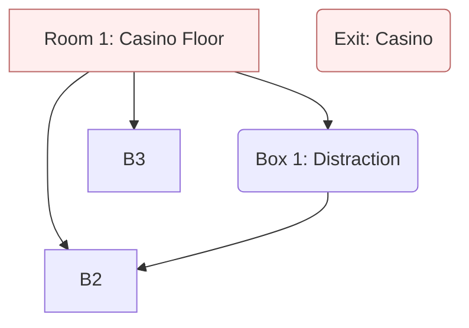

## Synopsis

_Casino Heist_ is an escape room that puts players in the role of a crack team
of burglars on a mission of retribution. This game can be broken into many rooms
with lots of places to explore.

The game is divided in multiple spaces. This is a casino heist, so of course you
will have a casino floor room with a card table decked out for a game. Later,
players will move to the operations part of the casino. This contains rooms for
the cashier, office, and janitor. You don't need a full room for each space.
Several spaces can be tucked in a closet or partitioned off with sheets. The
[flow diagram] and [setup] are at the end of this page. The [setup] also has
materials you can use to help you build the puzzles.

[flow diagram]: #flow-diagram
[setup]: #equipment-and-setup

## Scenario

You (the players) are here to rob the Lucky Strike casino. More specifically,
you are here to rob the bankroll of infamous mob boss Don Calzone, who owns the
casino. Calzone has been running a protection racket on you for years and then
recently turned around and stole what remained of your savings. The police won't
help, and with nowhere left to turn, you must steal your money back.

You have partnered with the infamous cat burglar Pierre Voleur, who has helped
you plan this operation, for a cut. The plan is to create a distraction at the
gaming tables, don an employee uniform, and sneak past the cashier. Once back
there, you will rewire the security cameras and break into the office. From
there, you should be able to get what you need to break into the vault.

## Casino Floor (Room 1)

The players enter the casino floor as unassuming customers. The space should be
set up with one or more gaming tables. These can be simulated with a simple
table and a green covering. The puzzles use props like card decks and glasses to
help complete the ensemble.

## Distraction (Box 1)

Before sneaking around, the thieves need to distract security and the other
personnel. They monkey with the cards on a gaming table and disrupt the game. In
the confusion, the thieves grab the pit boss' briefcase.

**Suggested Puzzle** On one of the tables is a fanned out deck of cards fanned.
The players can play with the cards (hopefully preserving the order). If the
players are observant, they will see that when the cards are stacked, there is a
[message on the side of the cards].

[message on the side of the cards]: /puzzles/arrangement/card-edge-message

## Flow Diagram

The materials and suggested puzzles of this escape room follow the
following flow diagram.

## Equipment and Setup

Here is a list of equipment you will need if setting up your escape room in the
same way as described above. This is organized by the items in the flow diagram
above. Where possible, I have provided material for you.

* [Room 1: Casino Floor](#casino-floor-room-1)
  * Contains one or more gaming tables with cards lain out, betting chips, and
    other items typical of a gambling hall.
  * Items:
    * Clue 1.0.1: Deck of cards spread out on gaming table
    * Clue 1.0.2: Chips of different colors spread out on gaming table
    * Clue 1.0.3: Glasses of different sizes with numbers on them
    * Clue 1.0.3: Pieces of ripped/crumpled trash with bases
* [Box 1: Distraction](#distraction-box-1)
  * Contents are in a locked briefcase or similar type of bag.
  * Puzzle: [card edge message]
    1. Scoop the cards for Clue 1.0.1 and arrange them in a stack.
    2. Along the side of the stack is written the code to a combination lock on the briefcase.
  * Items:
    1. Clue 1.1.1: [Employee start shift regulations](employee-start-shift.pdf)
    2. Clue 1.1.2: Camera puzzle tracks
       * [STL files for 3D printing](wire-trace-puzzle.zip)
       * [PDF file for paper printing](wire-trace-puzzle.pdf)

[card edge message]: /puzzles/arrangement/card-edge-message
