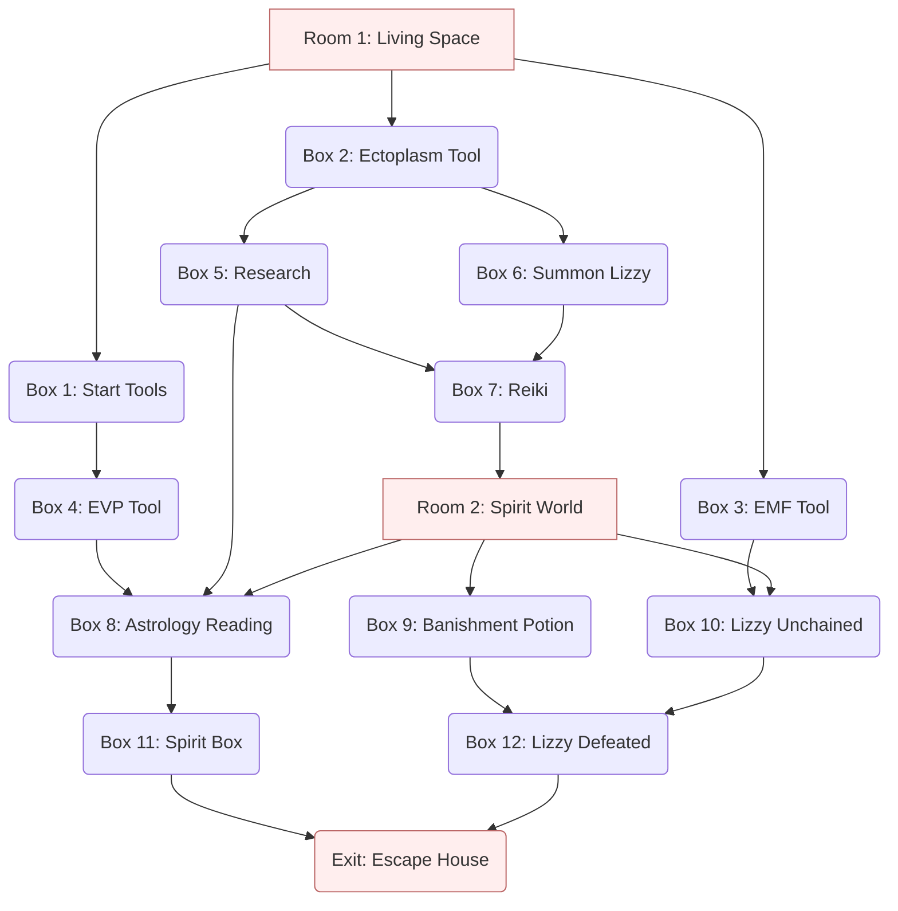

## Synopsis

_Ghost Chasers_ is an escape room that puts players in the role of
paranormal investigators. The room has plenty of puzzles, fun theming, and
multiple developments in the plot. When creating the puzzles for this room,
I incorporated ideas from actual tools used in paranormal investigations.
Whether you believe in them or not, it is fun to pretend.

The game is divided into two spaces. The first space features a dining
table with place settings. A dining area is perfect for this space. The
second space represents the spirit world. It should be a dark space with
spooky lighting and decorations. Black lights and Halloween decorations
work well here. The [flow diagram] and [setup] are at the end of this page.
The [setup] also has materials you can use to help you build the puzzles.
Also at the bottom is an [audio quick reference] that you can use as a
game master to have audio cues available to play at events.

[flow diagram]: #flow-diagram
[setup]: #equipment-and-setup
[audio quick reference]: #audio-quick-reference

## Scenario

You (the players) are paranormal investigators. Yesterday, a desperate
voice on the phone called you to a mansion on the outskirts of town. When
you arrive, the door pushes open when you knock, but your host is not there
to greet you. When you step inside, the door slams shut and latches behind
you. A moment later, candles flicker to life on their own. The room looks
normal, but the lack of living people is unnerving. You can feel that there
is something wrong.

It is time to get to work. Collect the tools of your trade and investigate
what spirits may be infesting this site.

## Living Space (Room 1)

The players start in the normal living area of a home. The space is
intended to be the area of a house where one might meet guests. A dining
room works well for this space.

The room should contain a table with several place settings of plates,
glasses, forks, knives, etc.

## Start Tool Collection (Box 1)

The players get together their ghost hunting tools. This first box
collects items for opening up the tool boxes.

**Suggested Puzzle** Mounted on one wall is [a sequence of digits]. Mounted
on the opposite wall is a mirror. The players need to solve a [reflected
code] puzzle by positioning themselves to view the digits in the mirror.
The mirror reflection has the correct code to open the lock.

[a sequence of digits]: reflected-digits.pdf
[reflected code]: /puzzles/mirror-images/reflected-code/

## Ectoplasm Reveal Tool (Box 2)

The players collect some tools they need for their task. The first tool on
the list is an "ectoplasm reveal tool."

**Suggested Puzzle** The cutlery in the place settings on the dining
table look normal. But on the [underside] of the knives are letters. The
letters will make little sense at first, but the knives can be put together
in a [stick word grid]. The words spell out a message that points to a
location for players to find a key where they [normally would not look]. I
made the message "look under chairs".



The key opens a box that contains, among other things, an "ectoplasm reveal
tool" (an ultraviolet light). It will be used later to [reveal secret
messages].

[underside]: /puzzles/hiding-places/underside/
[stick word grid]: /puzzles/arrangement/stick-word-grid/
[normally would not look]: /puzzles/hiding-places/unfair-hiding-places/
[reveal secret messages]: /puzzles/decoders/invisible-ink/

## EMF Tool (Box 3)

Another tool the players collect is an electromagnetic frequency (EMF)
detector. An EMF detector reads emissions that come from electric power
lines and electric devices. Some paranormal investigators believe that
ghosts can emit electromagnetic radiation and use EMF detectors to attempt
to find ghosts.

**Suggested Puzzle** Create an imitation EMF that contains a [map of the
room] that points to the location of a hidden object. The item might be a
key, which is easy to hide, that opens a larger box.

I created the map as a [simple web site] that imitated the EMF tool and
provided the map. There are straightforward tools for [publishing web
sites] even for users with no such experience. An even easier solution is
to drop a map image as an [online document].

A QR code is used to direct players to the online map. I used a [QR Cube],
but any [QR puzzle] would work.

[map of the room]: /puzzles/hiding-places/maps/
[simple web site]: https://sites.google.com/view/morelandsnl-emf-tool/home
[publishing web sites]: /equipment/internet/#web-site-builders
[online document]: /equipment/internet/#online-documents
[QR Cube]: /puzzles/qr-construction/cube/
[QR puzzle]: /puzzles/qr-construction/

## EVP Tool (Box 4)

The players search for an electronic voice phenomenon (EVP). EVP is a real
thing that paranormal investigators do. The idea is to do an audio
recording in a quiet room. Then you play back the recording and listen for
stuff in the background static. (Our pretend tool will work better than in
real life.)

**Suggested Puzzle** The first step is to have a [QR construction] puzzle
that will make a players phone EVP recorder. Here is a [fold back QR]
puzzle from [box 1] with a QR code that will take players to an [EVP
simulator].



In the [EVP simulator], players first have to hit the "Record" button and
then wait for the recording. Players will then be able to play back the
recording. They will first have to hit the "Vol Up" button until the volume
level is high. Once they do, they can play the following audio.



If the players listen carefully, in the static they can hear the numbers
six-six-four-three, which form the combination to the box's lock.

The box contains an encoding for astrological symbols, which will be used
[in a later puzzle](#spirit-box-box-11). The encoding can be embedded in its
own [symbol algebra].

{}
♉ + ♉ + ♉ = 9

♉ + ♑ + ♑ = 13

( ♉ × ♑ ) - ♐ = 13

♉ + ♑ + ♐ + ♐ + ♍ = 13
{}

The answers to this puzzle ♉-3, ♑-5, ♐-2, ♍-1. If you don't think the
players will enjoy doing math homework, you can alternatively just give a
straight lookup.

{}
1. ♍
2. ♐
3. ♉
4. ♊
5. ♑
6. ♎
7. ♓
{}

[symbol algebra]: /puzzles/paper-and-pencil/symbol-algebra/
[QR construction]: /puzzles/qr-construction/
[fold back QR]: /puzzles/qr-construction/fold-back/
[box 1]: #start-tool-collection-box-1
[EVP simulator]: https://www.open-sesame.xyz/ghostchasers/evp/

## Research (Box 5)

The players collect some research materials. In particular, they find an
article about dream analysis that will be useful later.



The players also find an enigmatic list of phrases.

{}
### Secrets to Long Life

Be Loving

Reap Compassion

Laugh Madly

Murder Kindly
{}

**Suggested Puzzle** Players have to find printed messages [underneath] or
[on the underside] of the plates in the place settings. The message
initially does not mean anything, but a further clue is revealed with the
UV flashlight ([ectoplasm tool]).

There are at least two ways to set up this puzzle. If you have a word lock,
print a single word under each plate to form a meaningless phrase, and then
circle one of the words with [an invisible ink pen]. The players must
reveal the word with the UV flashlight and use that word on a lock.

If you prefer to use a number lock, print a single digit under each plate
and place them in random order. In [invisible ink], write numbers to
indicate the order of the digits to form a code for a lock.

[underneath]: /puzzles/hiding-places/underneath/
[on the underside]: /puzzles/hiding-places/underside/
[ectoplasm tool]: #ectoplasm-reveal-tool-box-2
[an invisible ink pen]: /puzzles/decoders/invisible-ink/
[invisible ink]:/puzzles/decoders/invisible-ink/

## Summon Lizzy (Box 6)

The players use the tools at hand to summon the spirit that is haunting
this house. The players are contacted by a spirit who identifies itself as
"Lizzy." In the box have a picture of Lizzy. (The picture can be of any
innocent looking girl. Find a random picture on the internet or that comes
with a photo frame.) The picture comes with the following message.

{}
Help! I'm Lizzy and I think I may have been murdered. Now I'm stuck in this
limbo space: not alive, not dead. If I don't escape soon, the wraiths will
steal my soul forever. Open the portal to the spiritual world, release the
spirit, and save my soul!
{}

After the players open this box, you can play this audio file (for example,
from a smartphone) to reinforce the situation.



Additionally, players find an excerpt from [Lizzy's diary].

{}

Dear Diary,

Today was the best Day of my life. I met the man of my dreams: Todd. We met
at the park. He was walking his ferret. I was hiding in the bushes. He is
sooooo cute with his pouting Lips and big brown Eyebrows. I didn't have the
courage to talk, but I did find out where he lives. Tomorrow, we'll "meet"
again. I'll bring Mr. Knife for luck.

{}

**Suggested Puzzle** The players summon Lizzy with a [Ouija board]. You can
simulate this by shining the UV flashlight ([ectoplasm tool]) on a provided
Ouija board. The revealed ink shows the path of the entrance code word.



You could probably construct this puzzle with a store-bought Ouija board.
But if you are cheap, like me, you can just [print] the pattern of a board
on a piece of paper. When I originally did this, I first attempted to print
an image of a board. This, however, did not work because the invisible ink
pen smeared the printer ink just enough to make out the path of the ink.
Instead, you can use [this replica of a Ouija board with a blank
background] so you can draw in the blank space between letters.

[Lizzy's diary]: diary.pdf
[Ouija board]: https://en.wikipedia.org/wiki/Ouija
[print]: /equipment/printer/
[this replica of a Ouija board with a blank background]: ouija-board.pdf

## Learn Reiki (Box 7)

The players discover Reiki healing movements helpful for their goals.
[Reiki] is an alternative medicine technique based on energy flows through
the body. Part of Reiki involves moving your hands in various patterns to
manipulate these energy flows.

This box has several Reiki patterns for the players' reference.



Reiki is really a healing technique, not something that meant to unlock
doors. But I think it is safe to say it works equally well for either.

**Suggested Puzzle** This box opens up with a [code-word lookup] puzzle. First,
Lizzy's diary (from [box 6]) has several words with odd capitalization:
Day, Lips, Eyebrows, and Knife. The players need to match these with the
word lists in the paper from [box 5]. These words translate to the numbers
4 4 8 2.

[Reiki]: https://en.wikipedia.org/wiki/Reiki
[code-word lookup]: /puzzles/hidden-messages/lookup/
[box 6]: #summon-lizzy-box-6
[box 5]: #research-box-5

## Spirit World (Room 2)

The second room represents the spirit world. This room should be spooky and
contain ghostly decorations. Decorating this room is a chance to be
creative. Halloween decorations can work well here. Making the room dark
matches the theme, but make sure there is enough light to see the puzzles
and avoid any tripping hazards.

**Suggested Puzzle** Of the symbols provided in [box 7], one of them is
labeled "open dimensions." This is a clue that this symbol is used to open
the portal (i.e., door) to the spirit world.

The symbol has ordered arrows giving the proper directions to replicate
this symbol. The players must replicate these directions on a [directional
lock] to open the door. This is a form of the [sketch directions] puzzles.

[box 7]: #learn-reiki-box-7
[directional lock]: /equipment/locks/#directional-locks
[sketch directions]: /puzzles/miscellany/sketch-directions/

## Astrology Reading (Box 8)

The players consult astrological charts to help them in their quest.

(I am unaware real paranormal investigators using astrology, but I think it
meets the theme well.)

**Suggested Puzzle** Inside the [spirit world] is this map of the night sky
with astrological symbols on it.



This map should be printed as large as possible (either on a poster or on
multiple pieces of paper) to see its small features.

This map combines with the [list of items] in [box 5] to form a [grid
lookup] puzzle. The items in the list are "Be Loving", "Reap Compassion",
"Laugh Madly", and "Murder Kindly". Focusing on the first letter of each
phrase, we get B-L, R-C, L-M, and M-K. If we look up these pairs on the
map (looking at columns first), we see that they point to the astrological
symbols ♉, ♍, ♑, and ♐.

This still does not provide the code. These astrology symbols must be
turned into numbers using the clue provided in [box 4]. This box either
directly has the conversion of symbol to number or has a [symbol algebra]
puzzle to assign a number to each. In the numbering provided in the
[examples above](#evp-tool-box-4), these symbols translate to the
code 3152.

[spirit world]: #spirit-world-room-2
[list of items]: #secrets-to-long-life
[grid lookup]: /puzzles/decoders/grid-lookup/
[box 4]: #evp-tool-box-4

## Banishment Potion (Box 9)

When the players open this box, they find the instructions to create a
banishment potion. When the players open this box, they get a potion recipe
like this.

{}
### Banishment Potion

#### Ingredients

* 2 tablespoons Pus
* 4 sprigs Sneezewort
* 1 cup Urine
* 5 Tubeworms
* 3 Cockroaches

#### Directions

Melt pus in a large saucepan. Chop sneezewort and add to pus. Sauté until
sneezewort is soft. Add urine and bring to boil. Dice tubeworms and add to
urine/sneezewort mixture. Return to boil, reduce heat, cover, and simmer
for 15 minutes.

Pour mixture into a small trifle bowl. Slice cockroaches lengthwise and
arrange on top in a pentagram.
{}

**Suggested Puzzle** The banishment potion box can be opened with a code
provided by the [tea light message] puzzle. The tea light is placed on the
table in the first room and is lit as the players walk in. By the time the
players open the second room where this box is, the code should be visible
in the candle. The players just have to find it.

[tea light message]: /puzzles/hiding-places/tea-light/

## Lizzy Unchained (Box 10)

The players free the trapped soul, Lizzy, who pleaded for help ([box 6]).
However, as soon as the players succeed in releasing Lizzy, she reveals
herself as a malevolent spirit intent on committing evil.

When players unlock this "box," a horrible figure drops from the ceiling.
(The puzzle is set up as a [hanging boss]. A Halloween decoration of a
ghost works well for the figurine of Lizzy.) When Lizzy unfurls, a note is
also dropped revealing her true nature.

{}
Fools! Now that you have opened the portal, I will unleash hell upon the
Earth!
{}

When Lizzy is revealed, you can also play an audio file to pump up the
drama.

{}

Also dropping from Lizzy is a [list of potion ingredients]. This is a long
list of weird ingredients, each with a random digit next to it.

**Suggested Puzzle** The clue to unlocking Lizzy unchained is provided by
the [EMF tool (box 3)]. I used the [groovy blocks] puzzle. This is a tricky
puzzle, but providing the blocks early in [box 3] will give players some
more time to work it out.

[hanging boss]: /puzzles/machines/hanging-boss/
[list of potion ingredients]: potion-ingredients.pdf
[EMF tool (box 3)]: #emf-tool-box-3
[box 3]: #emf-tool-box-3
[groovy blocks]: /puzzles/arrangement/groovy-blocks/

## Spirit Box (Box 11)

A spirit box in another device that paranormal investigators will use. It
is an electronic device that makes a cyclic static sound and occasionally
barks out words. What the spirit box is doing is quickly cycling through FM
radio channels. It's basically a digital FM radio with the tuner up button
held down. As the radio scans through frequencies, it occasionally picks up
a sound. Some people think this is spirits trying to communicate. (Others
think it is a radio making sounds like radios do.)

**Suggested Puzzle** Like the other tools, the spirit box is emulated on a
player's phone and accessed through a QR code. Thus, a [QR construction]
puzzle is appropriate. You can use a [jigsaw QR] puzzle here. The following
QR code with the suggested cutout pieces works well.



These puzzle pieces come from [box 8] (and possibly others).

[jigsaw QR]: /puzzles/qr-construction/jigsaw/
[box 8]: #astrology-reading-box-8

## Lizzy Defeated (Box 12)

The players concoct a banishment potion and apply it on the evil spirit
Lizzy. On solving the puzzle, the players unlock the second part of the
[hanging boss]. Lizzy falls to the ground, defeated. When Lizzy falls, you
can play this audio file.



After Lizzy falls, players find a shopping list.

{}
#### Lizzy’s Shopping List

 1. Blood
 2. Bone
 3. Gore
 4. Pickles
 5. Violence
 6. Fructose
 7. Sweat
 8. Evil
 9. Dark
10. Red Rum
{}

**Suggested Puzzle** The [banishment potion] from [box 9] and the [list of
potion ingredients] from [box 10] are combined in a variation of the
[code-word lookup] puzzle. The ingredients of the banishment potion are
Pus, Sneezewort, Urine, Tubeworms, and Cockroaches. Looking these up in the
[list of potion ingredients], we see these are associated with the digits
1, 2, 5, 9, and 0, respectively.

But this is not the correct order of the digits. Each ingredient has a
quantity containing a number. The ingredients need to be listed in the
order of these numbers: 1-Urine, 2-Pus, 3-Cockroaches, 4-Sneezewort,
5-Tubeworms. This order yields the correct code: 51029.

[banishment potion]: #banishment-potion
[box 9]: #banishment-potion-box-9
[box 10]: #lizzy-unchained-box-10

## Escape House (Exit)

With Lizzy defeated, the players must close the connection to the
metaphysical world and unlock the door to the outside world. Then they can
emerge from the house victorious.

**Suggested Puzzle** The [spirit box] from [box 11] plays a sound:



Within this sound, words can be discerned: Evil, Gore, Blood, Pickles. In
another variation of the [code-word lookup] puzzle, these words are
cross-referenced in [Lizzy's shopping list] from [box 12]. This provides
the digits 8, 3, 1, and 4, which form the proper code 8314.

[spirit box]: https://www.open-sesame.xyz/ghostchasers/spirit-box
[box 11]: #spirit-box-box-11
[Lizzy's shopping list]: #lizzys-shopping-list
[box 12]: #lizzy-defeated-box-12

## Flow Diagram

The materials and suggested puzzles of this escape room follow the
following flow diagram.

## Equipment and Setup

Here is a list of equipment you will need if setting up your escape room in
the same way as described above. This is organized by the items in the flow
diagram above. Where possible, I have provided material for you.

* [Room 1: Living Space](#living-space-room-1)
  * Contains a dining table with place settings and other possible aristocratic
    props.
  * Items:
    * Clue 1.0.1: Tea light with [tea light message] hidden in the wax. Light
      the candle as the game starts.
    * Clue 1.0.2: Plates with [messages](plate-bottoms.pdf) and invisible ink
      hidden [underneath] or [on the underside].
    * Clue 1.0.3: Blunt knives with [letters](knife-message.pdf) hidden [on
      the underside]s.
    * Clue 1.0.4: Mirror, mounted on wall.
    * Clue 1.0.5: A [numeric code](reflected-digits.pdf), mounted on wall
      (visible as a reflection in the mirror).
    * Clue 1.0.6: A cube puzzle with a QR code attached to one face and then
      jumbled.
    * Clue 1.0.7: A [ouija board](ouija-board.pdf) with invisible ink markings.
    * Clue 1.0.8: A key taped to the underneath a chair.
    * Clue 1.0.9: A key hidden elsewhere in another [unfair hiding spot].
    * Boxes 1, 2, 3, 4, 5, 6, 7
* [Box 1: Start Tools](#start-tool-collection-box-1)
  * Puzzle: [reflected code]
    1. View Clue 1.0.5 (numeric code) in Clue 1.0.4 (the mirror) to reveal a
       different code.
    2. Answer: 8512
  * Items:
    * Clue 1.1.1: [Fold-back QR code](fold-back-qr.pdf)
* [Box 2: Ectoplasm Tool](#ectoplasm-reveal-tool-box-2)
  * Puzzle: [underside] + [stick word grid]
    1. A close inspection of Clue 1.0.3 reveals letters on the underside of the
       knives.
    2. The knives are arranged to spell "knife".
    3. The remainder of the letters spell the message "LOOK UNDER CHAIRS".
    4. Taped under one chair is Clue 1.0.8, a key that opens the box.
  * Items:
    * Clue 1.2.1: An ultraviolet flashlight (referred to as an ectoplasm
      detection tool).
* [Box 3: EMF Tool](#emf-tool-box-3)
  * Puzzle: [QR Cube] + [map]
    1. Unscramble Clue 1.0.6 to properly arrange the QR code.
    2. Scan the QR code to an online page or document containing a map of the
       room pointing to the location of Clue 1.0.9 (a key).
    3. Use the key to open a box.
  * Items:
    * Clue 1.3.1: [Groovy blocks], which can be 3D printed with [this
      model](groovy-blocks-model.stl) or cut into wood with a table saw and
      [this pattern](groovy-blocks-pattern.pdf).
* [Box 4: EVP Tool](#evp-tool-box-4)
  * Puzzle: [fold back QR]
    1. Fold back the edges of Clue 1.1.1 to align the edges of the QR code on
       the opposite side of the paper.
    2. Scan the QR code to go to the [EVP simulator].
    3. Click the `Record` button.
    4. Click the `Vol Up` button until the volume level reads high.
    5. Play the audio file to hear the code.
    6. Answer: 6643
  * Items:
    * Clue 1.4.1: [Astrological Symbol Algebra](astro-algebra.pdf) **---or---**
      Clue 1.4.2: [Astrological Symbol Lookup](astro-lookup.pdf).
* [Box 5: Research](#research-box-5)
  * Puzzle: [underneath] or [underside] + [invisible ink]
    1. Find messages underneath or on the underside of Clue 1.0.2.
    2. Shine Clue 1.2.1 on the messages to reveal the secret code.
  * Items:
    * Clue 1.5.1: [Research paper](dream-decoder.pdf) on interpreting dreams.
    * Clue 1.5.2: [Phrases for life](life-phrases.pdf).
* [Box 6: Summon Lizzy](#summon-lizzy-box-6)
  * Puzzle: [invisible ink]
    1. Shine Clue 1.2.1 on Clue 1.0.7 to reveal a [path](ouija-message.jpg).
    2. Answer ghost
  * Items:
    * Clue 1.6.1: [A note from Lizzy asking for help](lizzy-help.pdf).
    * Clue 1.6.2: An excerpt from [Lizzy's diary].
* [Box 7: Reiki](#learn-reiki-box-7)
  * Puzzle: [code-word lookup] with odd capitalization: 
    1. Identify words in Clue 1.6.2: Day, Lips, Eyebrows, and Knife.
    2. Find words in lists in Clue 1.5.1 and convert to numbers.
    3. Answer: 4482
  * Items:
    * Clue 1.7.1: [Reiki symbols](reiki.pdf) with path directions.
* [Room 2: Spirit World](#spirit-world-room-2)
  * Puzzle: [sketch directions]
    1. Note that one of the symbols in Clue 1.7.1 is labeled "Open Dimensions".
    2. Also note that the symbol has numbered arrows noting the order and
       directions of the path.
    3. Enter these directions into a [directional lock].
    4. Answer: → ← → ↑
  * Items:
    * Clue 2.0.1: [Map of night sky with astrological
      symbols](constellations-map.pdf). 
    * Boxes 8, 9, 10
* [Box 8: Astrology Reading](#astrology-reading-box-8)
  * Puzzle: [grid lookup] + [symbol algebra] + [symbol substitution]
    1. Note the first letters of each phrase in Clue 1.5.2: B-L, R-C, L-M, M-K
    2. Use each pair of letters to find the corresponding grid component in Clue
       2.0.1 based on the reference grid letters around the outside.
    3. Note the astrological symbol in each of these grid components: ♉, ♍, ♑,
       and ♐.
    4. Solve the algebra in Clue 1.4.1 (if provided) to find a numeric value
       associated with each symbol.
    5. Convert the map symbols to numbers with the algebra solution (or Clue
       1.4.2 if provided instead) to reveal the code.
    6. Answer: 3152.
  * Items:
    * Clue 2.8.1: [QR jigsaw pieces](jigsaw-qr.png)
* [Box 9: Banishment Potion](#banishment-potion-box-9)
  * Puzzle: [tea light message]
    1. Over time, a code appears in Clue 1.0.1. (Make sure the candle stays lit
       until the code is found. If the players blow it out, relight it and say
       the candle relights on its own.)
  * Items:
    * Clue 2.9.1: [Banishment potion](potion-recipe.pdf)
* [Box 10: Lizzy Unchained](#lizzy-unchained-box-10)
  * Puzzle: [groovy blocks] + [hanging boss]
    1. Stack the Clue 1.3.1 blocks correctly to reveal to code on the side.
    2. Answer: 8347
  * Items:
    * Clue 2.10.1: [List of potion ingredients].
    * Box 12 (the second half of the [hanging boss]).
* [Box 11: Spirit Box](#spirit-box-box-11)
  * Puzzle: [jigsaw QR]
    1. Assemble the pieces of Clue 2.8.1.
    2. Scan the QR code.
  * Items:
    * Clue 2.11.1: Web page for [spirit box].
* [Box 12: Lizzy Defeated](#lizzy-defeated-box-12)
  * Puzzle: [code-word lookup]
    1. Look up the ingredients from Clue 2.9.1 to get the associated number in
       Clue 2.10.1. This gives the digits 1, 2, 5, 9, and 0, respectively.
    2. Reorder these numbers based on the quantity listed in Clue 2.9.1.
    3. Answer: 51029
  * Items:
    * Clue 2.12.1: [shopping list](shopping-list.pdf)
* [Exit: Escape House](#escape-house-exit)
  * Puzzle: [code-word lookup]
    1. Listening to Clue 2.11.1, 4 words are discernable: Evil, Gore, Blood,
       Pickles.
    2. Look up these words in Clue 2.12.1.
    3. Answer: 8314

[unfair hiding spot]: /puzzles/hiding-places/unfair-hiding-places/
[map]: /puzzles/hiding-places/maps/
[symbol substitution]: /puzzles/ciphers/symbol-substitution/

## Audio Quick Reference

As the players progress in the game, there are some audio files you can play at
certain events to add ambience. Here is a quick reference tyo play each file.

Box 6: Summon Lizzy opened (Lizzy asks for help) \


Box 10: Lizzy Unchained (Evil Lizzy is revealed and threatens players) \


Box 12: Lizzy Defeated (Lizzy is defeated and falls to the ground) \

