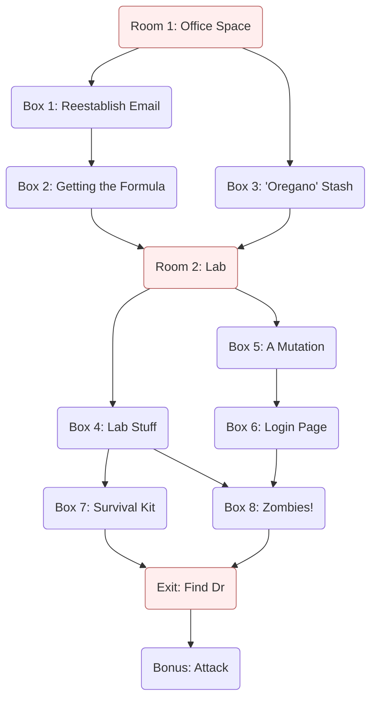

## Synopsis

_Virus_ is an escape room that follows the players as they battle a new
pandemic. This is a good place to start if you are creating your first
escape room. It is a fairly small escape room in terms of the number of
puzzles and spaces. The suggested puzzles are fairly easy to set up, and
there is a lot of flexibility in replacing puzzles if you so desire.

The game is divided into two spaces. They are themed first as an office
space and a laboratory. The [flow diagram] is drawn at the end of this
page as well as the [setup]. This [setup] also has a list of materials
you can use to help you build the puzzles.

[flow diagram]: #flow-diagram
[setup]: #equipment-and-setup

## Scenario

The players are researchers at a microbiology and infectious diseases
laboratory. The lead researcher of the lab, Dr. Sarah Beaker, has been away
in the field researching a recent outbreak of NEONORO, a deadly and highly
infectious virus, while you work at the home base to understand the nature
of the disease.

Today at work, the players are presented with a package sent from Dr.
Beaker. It [contains a note] (among other clues) in which she is requesting
help from the players.

{}
As you know, I have been traveling the world researching NEONORO and
helping where I can. Thank you for taking care of the laboratory in my
absence, but things have gone sideways and now I need your direct help.

First, we need to reestablish communication. General Halftrack, who
originally sponsored this excursion, has suddenly tried to block my
investigations. He has severed my connection to our mail server. We do not
have time to mail letters back and forth.

I cannot fix my connection from here. You must do it from the lab complex.
I am sending you the digital codes to do it.
{}

Dr. Beaker is stranded without communication. The players need to
reestablish this communication.

[contains a note]: initial-mail.pdf

## Office Space (Room 1)

The players start in a room themed as standard office space. Simple office
materials (desk, table, chairs, bookshelf) set the theme.

The players start with a packet of material sent from Dr. Beaker. Other
clue puzzles, particularly those that are paper based or require a flat
surface, may also be placed around the room.

## Reestablishing Email (Box 1)

Using clues from the package provided by Dr. Beaker's package, the players
reestablish communication by connecting to her secret email.

**Suggested Puzzle:** The package contains a piece of paper containing a
[QR fold-in]. When scanned, the solved QR code sends a player's phone to an
[online document] or [web document] that has an email from Dr. Beaker with
further instructions to find a formula for virus treatment and break into
her private lab.

{}
**From:** Dr. Susan Beaker &lt;susan.beaker@ccd.gov&gt;  
**To:** Virus Research Team &lt;research-staff@ccd.gov&gt;  
**Subject:** Please help

---

Good job! You have reestablished my connection to our communication and
research notes. Since General Halftrack isolated me 3 days ago, I have
been desperate  for help.

To start, I need you to find the formula to the virus treatment that I
developed merely 2 day before I left for this emergency trip. Sensing
danger, I locked away my notes, and it appears I was right to do so. I
cannot give you instructions directly over this insecure channel, but you
are clever and I know you will figure it out.

Next, I need you create a secure cryptographic link to me so that we can
talk more freely. This can only be done from within my private lab. My lab
is locked, so you will have to break in.

These 16 weeks on the road have been exhausting, and I'm so glad to be
able to talk to you again.

--Suzzy
{}

[QR fold-in]: /puzzles/qr-construction/fold-in/
[online document]: /equipment/internet/#online-documents
[web document]: /equipment/internet/#web-site-builders

## Getting the Formula (Box 2)

Per Dr. Beaker's email, the players need to find the formula for treatment.
Because the email is not secure, Dr. Beaker cannot overtly say how to get
the formula. But the email contains a hidden code that is used to open a
box revealing some of Dr. Beaker's lab notes containing the formula (and
multiple other items used later).

**Suggested Puzzle:** Dr. Beaker's email contains a [hidden message] with a code
to the box containing her formula. The previously shown message fits will with
the [number words] puzzle. [This online
document](https://www.open-sesame.xyz/virus/help-email) can be a target for this
puzzle.

Once open, the box contains lab notes describing a formula Dr. Beaker has
been working on such as this.

{}

Lab notes of Dr. Susan Beaker

We have made good progress on a formula to reduce respiratory infection in
patients. The compound includes the following elements.

* Sodium
* Bromine
* Mercury
* Boron

The formula is currently unstable, but we have high hopes to stabilize the
compound.

{}

[hidden message]: /puzzles/hidden-messages/
[number words]: /puzzles/hidden-messages/number-words/

## Finding the Doctor's Stash (Box 3)

Dr. Beaker has hiding a secret stash of "oregano." She has also misplaced
some critical items that the players need with this stash, so they will
have to find it.

**Suggested Puzzle** The [crossword lookup] puzzle works well here. The
crossword itself can be simply found in the room as something someone
randomly left. A player can solve the crossword while others solve other
parts. You will likely need to create a custom crossword to match some
sequence of items in the room.

The resulting code opens a box containing some items required for later
puzzles. I personally also place a small baggie of oregano, which has no
practical value but adds some humor.

[crossword lookup]: /puzzles/paper-and-pencil/crossword-lookup/

## The Doctor's Lab (Room 2)

According to Dr. Beaker's email, the players need to break into the lab.
The lab is a second room behind a locked door. The players will have to
solve a puzzle to unlock the door to this room.

The room itself should be themed like a laboratory. It can have props like
flasks and tubes that are reminiscent of a lab. More puzzle pieces and
boxes are placed in this room.

**Suggested Puzzle** The [stick word grid] puzzle can be used here. The sticks
can be hid in box 3 and/or others, and the formula gives the arrangement of the
sticks. In the example of the formula above, players can translate the names of
the elements and convert them to element symbols. (A periodic table should be
provided for reference.) I used the list of symbols above to arrange the sticks
below to spell out a message with a numerical code.



[stick word grid]: /puzzles/arrangement/stick-word-grid/

## Random Lab Stuff (Box 4)

Not much to advance the plot here. The players rummage through the lab to
find more clues.

**Suggested Puzzle** You can use a [paper segment display] to provide a
code. The coded pattern can be provided in a box in the previous room, and
the decoder device in the room.

[paper segment display]: /puzzles/decoders/paper-segment-display/

## A Mutation (Box 5)

On entering the lab, the players search around to find notes from Dr.
Beaker about the progression of the NEONORO virus.

**Suggested Puzzle** One of the items in the lab is a container
containing a key and a faux caustic liquid. The players must [fish the key
with a magnet] provided in a previous box.

Along with other clues, this box contains a note with progression of the
NEONORO virus and further instructions.

{}

I have discovered something very strange about this recent mutation of the
NEONORO. We are starting to see some very unique behavior.

I need to talk to you securely. Hack into our encrypted system so that we
can send messages freely.

Suzy
{}

[fish the key with a magnet]: /puzzles/tools/magnet-fishing/

## Email Login Page (Box 6)

The players must find a way to log in to Dr. Beaker's personal email.

**Suggested Puzzle** The note about the mutation contains a [QR] code that
links to an [email login form]. The username is provided and the players
must fill out the password.



However, there are no clues about what the password might be, and there is
no logical answer. This is an example of a [pointless form], and attempting
to guess a password is pointless. Instead, players need to notice the
[Reset Password] link, which will take them to the correct form.

[QR]: /equipment/internet/#qr-codes
[email login form]: https://www.open-sesame.xyz/virus/login/
[pointless form]: /puzzles/misdirection/pointless-form/
[Reset Password]: https://www.open-sesame.xyz/virus/login/reset/

## Survival Kit (Box 7)

The NEONORO virus is about to get much worse. The players need to open a
survival kit. The kit contains foam dart blaster toy guns and part of the
final clue to the exit door.

**Suggested Puzzle** You can use a [jigsaw holes] puzzle for this box. The
base board would be placed in the first room, and the first part the fill
pieces are in an early box. This gives the players an early chance to get
started and might result in a [fake code]. A final group of puzzle pieces
in [box 4] reveal the final code.

[jigsaw holes]: /puzzles/construction/jigsaw-holes/
[fake code]: /puzzles/construction/jigsaw-holes/#fake-code
[box 4]: #random-lab-stuff-box-4

## Zombies! (Box 8)

The players must hack into Dr. Beaker's personal email to get private
messages. Once they do so, they can get important information directly from
Dr. Beaker.

**Suggested Puzzle** The result of [box 6] is a [reset password] form that
provides a backdoor to accessing the email without knowing the password.
The reset form has 3 typical questions:

* What are your favorite FOODS?
* What MONTH were you born?
* What is the name of your CHILD?

The players don't directly know the answers to these questions, but there
is a clue to help them figure it out.

Throughout the game the players have been collecting Styrofoam cups with
letters written around the rims. At this point in the game, the players
have collected 5 such cups. When stacked together, the cups form a
[cryptex].



The players need to stack the cups in the right order and twist the cups so
that the highlighted words in the security questions, FOODS, MONTH, and
CHILD, are spelled on the cups. The remaining letters form the words of the
answers to the security questions: CANDY, MARCH, and JOHNY.

Once the players enter these words in the [reset password] form, they are
taken immediately to a [secure note from Dr. Beaker]. At the bottom of the
note the code to a box of physical items.

{}
**From:** Dr. Susan Beaker &lt;susan.beaker@cyberdyne.gov&gt;  
**To:** Virus Research Team &lt;research-staff@ccd.gov&gt;  
**Subject:** Zombies!

---

Thank goodness you were able to get into the lab and access our secure
communication system! I have a lot to tell you that you must keep secret.

My investigation of NEONORO patients has revealed something startling. We
all know that 5-10% of patients develop serious respiratory problems. But
this turns out to be only a minor side effect of the disease. The true
nature is much, much worse.

We have found that the virus lies dormant in seemingly healthy patients.
Over the course of about 6 months the virus mutates, and its behavior
changes. At this point, the disease attacks the cerebrum, drastically
reducing cognitive function. From there, the virus rapidly progresses to
the adrenal glands, which respond by generating capacious amounts of
cortisone and adrenaline. At this point, the patient becomes mindlessly
aggressive.

For lack of a better term, these victims are turning into zombies. They
ruthlessly attack any living thing within reach. And as they salivate and
bite, they continually spread the disease to other victims. I estimate we
have about 4 days to contain this before we have a global disaster.

Keep this on the down low! In particular, I do not trust General Halftrack.
The behavior of this virus suggest there might have been some military
engineering behind it.

Fortunately, I have prepared for this (rather predictable) event. I
stockpiled some supplies in the laboratory. Unfortunately, I don't remember
where I put everything. Start by looking in my briefcase. The code is 4288.

Once you have gathered everything, I need you to come to me. Hurry!

--Suzzy
{}

[box 6]: #email-login-page-box-6
[cryptex]: /puzzles/arrangement/cup-cryptex/
[secure note from Dr. Beaker]: https://sites.google.com/view/morelandsnl-secure-message/?usp=sharing

## Find Dr. Beaker (Exit)

The final challenge of this escape room is to meet up with Dr. Beaker so
that she and the players can together battle the NEONORO virus raging the
planet. This will set the players on a globetrotting adventure following
her steps.

**Suggested Puzzle** To find Dr. Beaker, they have to follow the path she
made while in the field investigating the virus. The [map trace] puzzle
allows players to do this. In the room is a provided map of the world. This
can be a printed poster, a globe, or board from a game that is played on a
map.

Scattered in boxes around the room are clues on the locations Dr. Beaker
has visited, perhaps in the form of airline tickets with departing and
arrival locations. The players have to put these locations together in the
proper order and then trace that itinerary on the map. The directions
provide the code for a [directional lock] on the exit door.

[map trace]: /puzzles/mazes/map-trace/
[directional lock]: /equipment/locks/#directional-locks

## Attack! (Bonus)

Once the players solve the final puzzle and open the exit door, they have
completed the escape room. As a fun (optional) bonus reward for completing
the room, the players get to shoot their way through an onslaught of
zombies.

To set this bonus up, place some foam dart blaster toy guns (such as Nerf
guns) in the [survival kit]. Also, print up some pictures of zombies and
post them on the far side of the exit door. When the players open the exit
door and see the zombies, you can ramp up the tension by yelling. "Oh, no!
Zombies. Quick, grab your guns. Shoot your way out!" At this point, the
players are free to get rambunctious in running around and shooting
targets.

There is no additional puzzle in this activity. But this is a very fun way
to end the challenge of your escape room.

[survival kit]: #survival-kit-box-7

## Flow Diagram

The materials and suggested puzzles of this escape room follow the
following flow diagram.

## Equipment and Setup

Here is a list of equipment you will need if setting up your escape room in
the same way as described above. This is organized by the items in the flow
diagram above. Where possible, I have provided material for you.

* Starting packet contents (handed to players at start)
  * Clue 0.0.1: [Note from Dr. Beaker](initial-mail.pdf)
  * Clue 0.0.2: [QR Puzzle](establish-email-qr.pdf) (provided document contains
    both easier and harder fold-ins)
  * Clue 0.0.3: [Crossword Puzzle](equipment-crossword.pdf)
  * Clue 0.0.4: Jigsaw puzzle with pieces missing.
* Room 1: Office Space
  * Items:
    * Clue 1.0.1: A copy of the [Periodic Table of
      Elements](https://en.wikipedia.org/wiki/Periodic_table). It can be a
      poster mounted on a wall or a paper available elsewhere. Free printable
      versions are available on the web.
    * Clue 1.0.2: [Equipment Cleaning Schedule](equipment-schedule.pdf)
    * Boxes 2, 3
* Box 1: Reestablish Email
  * Puzzle: [QR fold-in]
    1. Fold Clue 0.0.2 to build proper QR code.
    2. Code leads to on-line email.
  * Items: This is not really a physical box, but rather a page providing a
    written message.
    * Clue 1.1.1: [Email requesting
      help](https://www.open-sesame.xyz/virus/help-email) (online)
* Box 2: Getting the Formula
  * Puzzle: [number words]
    1. Find the hidden code in Clue 1.1.1 by putting together all the
       numbers in the email.
    2. Answer: 3216
  * Items: A locked box, briefcase, or file cabinet containing the formula.
    * Clue 1.2.1: [Formula](formula-notes.pdf)
    * Clue 1.2.2: [Paper segment display hole template](hole-digits.pdf)
* Box 3: 'Oregano' Stash
  * Puzzle: [crossword lookup]
    1. Solve the crossword puzzle (Clue 0.0.3).
    2. Find equipment listed in Clue 1.0.2 in the completed puzzle.
    3. The numbers for each word forms the digits of the code.
    4. Answer: 6834
  * Items: A container like a bag, duffle, or purse containing personal items.
    * Clue 1.3.1: Popsicle sticks with element symbols written in
      [this pattern](element-sticks.jpg)
    * Clue 1.3.2: A magnet on a string
    * Clue 1.3.3: Puzzle pieces set 1 (optional)
* Room 2: Lab
  * Puzzle: [stick word grid]
    1. Translate the element names in the formula (Clue 1.2.1) with the
       periodic table (Clue 1.0.1).
    2. Arrange the popsicle sticks (Clue 1.3.1) so that the top element symbols
       match the translated list in the formula.
    3. The letters of the formula are put together to form a message: N I Ne F O
       U R Ni Ne O Ne -> NINe FOUR NiNe ONe
    4. Answer: 9491
  * Items:
    * Clue 2.0.1: Acid beaker (A vase or other container with an opening too
      small to reach into the bottom. In the container is some water and a key.
      Under the container is [a note](acid-message.pdf) warning/instructing
      players not to move or empty the container, which would be cheating.)
    * Clue 2.0.2: Paper with [coded segment pattern](hole-digits.pdf)
    * Boxes 4, 5, 7
* Box 4: Lab Stuff
  * Puzzle: [paper segment display]
    1. Lay the coded segment pattern (Clue 2.0.2) on a flat surface.
    2. Place the display hole template (Clue 1.2.2) on the left side of the
       pattern to reveal the first digit.
    3. Slide the hole template to subsequent positions to reveal the rest of the
       digits.
    4. Answer: 3594
  * Items:
    * Clue 2.4.1: [Cryptex] ([This pattern](cryptex-puzzle.pdf) to help form
      cryptex out of styrofoam cups.)
    * Clue 2.4.2: Puzzle pieces set 2
* Box 5: A Mutation
  * Puzzle: [magnet fishing](/puzzles/tools/magnet-fishing/)
    1. Dip the magnet (Clue 1.3.2) into the acid beaker (Clue 2.0.1) until the
       key attaches to the magnet.
    2. Pull the magnet and key out of the beaker.
    3. Open the box padlock with the key.
  * Items:
    * Clue 2.5.1: [Message about a new virus mutation](mutation-message.pdf)
    * Clue 2.5.2: [Message about security protocols](security-memo.pdf)
* Box 6: Login Page
  * Puzzle: [pointless form]
    1. Scan the QR code on the message about security protocols (Clue 2.5.2) to
       access the [login page](https://www.open-sesame.xyz/virus/login/).
    2. The form will always report "Incorrect Password". There is no correct
       password.
    3. The players click the "Reset Password" link at the bottom to access the
       actual form to access the system.
  * Items:
    * Clue 2.6.1: [Password Reset Form](https://www.open-sesame.xyz/virus/login/reset/)
* Box 7: Survival Kit
  * Puzzle: [jigsaw holes]
    1. Players add puzzle pieces set 1 (Clue 1.3.3) to base jigsaw puzzle (Clue
       0.0.4). This will reveal one set of digits.
    2. Players add puzzle pieces set 2 (Clue 2.4.2) to jigsaw puzzle to reveal
       second set of digits.
    3. Answer (suggested): 1547
  * Items:
    * Clue 2.7.1: [World Map](world-map.pdf)
    * Clue 2.7.2: Foam Dart Guns
* Box 8: Zombies!
  * Puzzle: [cryptex]
    1. Players rotate the rings of the cryptex (Clue 2.4.1) to form the words
       (foods, month, child) highlighted in the password reset form (Clue
       2.6.1).
    2. Next to each of these words is a secondary answer word (candy, march,
       tyler).
    3. These words are entered into the respective box in the form.
    4. Successfully submitting the form provides access to [another email from
       Dr. Beaker](https://www.open-sesame.xyz/virus/login/secret-email/).
    5. At the end of the email is a briefcase code.
    6. Final answer: 4288
  * Items:
    * Clue 2.8.1: [Boarding Passes](boarding-passes.pdf)
* Exit: Find Dr
  * Puzzle: [map trace]
    1. Order the boarding passes (Clue 2.8.1) by matching arrivals to departures
       to determine the order countries were visited.
    2. Trace the country order on the world map (Clue 2.7.1).
    3. Enter the primarily North/South/West/East directions into a directional
       lock.
    4. Answer: South, East, North, East, North, West (i.e., Down, Right, Up,
       Right, Up, Left)
    5. Note: If you cannot get a directional lock, consider this [directional
       lock alternative].
* Bonus: Attack (optional)
  * Place some pictures of zombies outside of the exit door.
  * Players grab the foam dart guns (Clue 2.7.2) and shoot at the zombie targets
    as they "fight" their way to Dr. Beaker.

[directional lock alternative]: /equipment/directional-lock-alternative/
